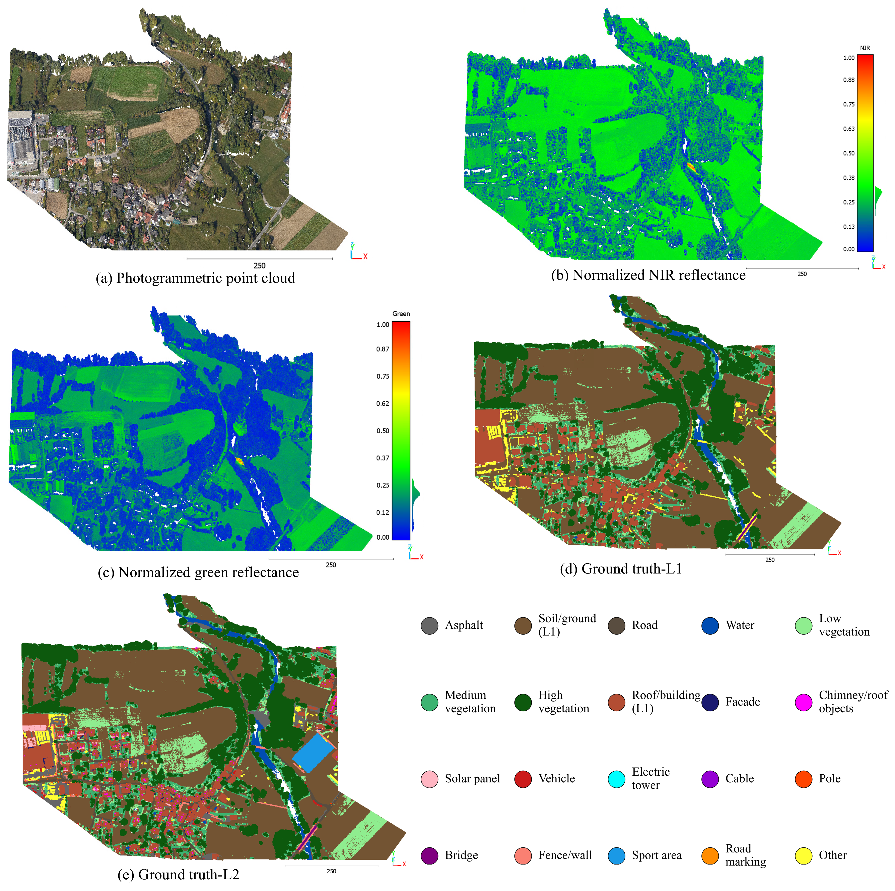
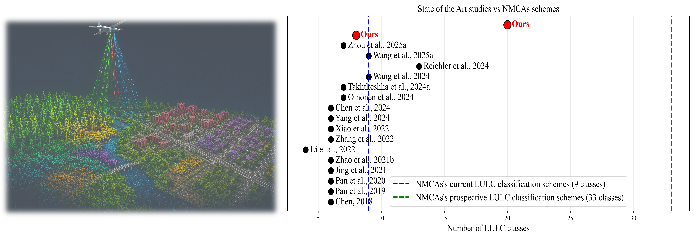
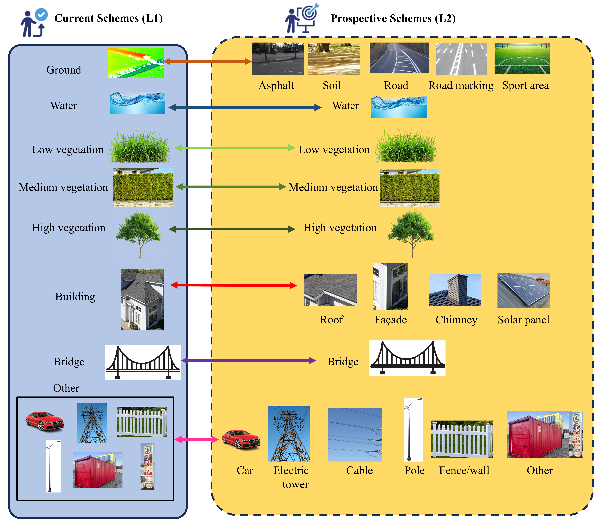

# Loosdorf-MSL: Benchmark Dataset & Code for LULC Classification Using Multispectral LiDAR 
[**Narges Takhtkeshha**](https://github.com/narges-tk)<sup>1,2</sup>, 
[**Aldino Rizaldy**](https://github.com/aldinorizaldy)<sup>3,4</sup>, 
**Markus Hollaus**<sup>2</sup>, 
**Juha Hyyppä**<sup>5</sup>, 
**Fabio Remondino**<sup>1</sup>, 
**Gottfried Mandlburger**<sup>2</sup>

<sup>1</sup> 3D Optical Metrology (3DOM), Bruno Kessler Foundation (FBK), Trento, Italy  
<sup>2</sup> Department of Geodesy and Geoinformation, TU Wien, Vienna, Austria  
<sup>3</sup> Helmholtz Institute Freiberg for Resource Technology (HIF), HZDR, Freiberg, Germany  
<sup>4</sup> Remote Sensing and Geoinformatics, Freie Universität Berlin, Berlin, Germany  
<sup>5</sup> Department of Remote Sensing and Photogrammetry, Finnish Geospatial Research Institute (FGI), National Land Survey of Finland, Espoo, Finland


<p align="center">
  <a href="https://www.sciencedirect.com/science/article/pii/S2667393226000402">
    
  </a>
  <a href="https://geo.tuwien.ac.at/Loosdorf-MSL">
    
  </a>
</p>



## Loosdorf-MSL Benchmark Dataset
The **Loosdorf-MSL benchmark dataset** is publicly available at [geo.tuwien.ac.at/Loosdorf-MSL](https://geo.tuwien.ac.at/Loosdorf-MSL) 🥳.  

The dataset provides multispectral airborne LiDAR data acquired over the Loosdorf–Melk region in Lower Austria and is intended to support research and industry in multispectral LiDAR processing and related 3D geospatial applications.
An example of the dataset is shown below.



## LULC Classes
The LULC classes are defined based on our questionnaire conducted with participating **European National Mapping and Cadastral Agencies (NMCAs)**, supported by **European Spatial Data Research (EuroSDR)**, addressing current and prospective LULC classification schemes of NMCAs. The LULC-L1 (current schemes) includes 8 classes, while the LULC-L2 (prospective schemes) includes 20 classes.



## DL Models Benchmarking


### LULC-L1 (geometry + green + NIR)

| Class | KPConv | KPConvX | SPT | HPF | PTv1 | PTv3 | SpUnet |
|:---|---:|---:|---:|---:|---:|---:|---:|
| Ground | 94.9 | 93.7 | <u>98.6</u> | <u>98.6</u> | 98.4 | **98.8** | **98.8** |
| Water | 22.3 | 28.8 | 50.5 | 40.4 | 37.2 | **51.1** | 47.6 |
| Low vegetation | <u>72.4</u> | 66.0 | 58.7 | 59.8 | 67.6 | **72.6** | 70.0 |
| Medium vegetation | **89.3** | <u>84.6</u> | 76.8 | 66.8 | 76.5 | 83.5 | 81.1 |
| High vegetation | **98.0** | <u>96.6</u> | 95.6 | 90.8 | 95.7 | 97.3 | 96.1 |
| Building | **91.2** | 86.5 | <u>89.9</u> | 89.4 | 85.2 | 87.2 | 88.9 |
| Bridge | 53.2 | **92.8** | <u>89.8</u> | 81.4 | 64.4 | 91.0 | 84.1 |
| Other | 41.3 | 34.7 | 38.1 | 41.0 | <u>43.4</u> | **45.8** | 43.3 |
| **mIoU (%)** | 70.3 | 73.0 | 74.8 | 71.1 | 71.0 | **78.4** | <u>76.3</u> |
| **mAcc (%)** | 83.6 | **87.8** | 84.2 | 81.2 | 78.5 | <u>85.6</u> | 84.4 |
| **OA (%)** | 95.2 | 94.1 | 97.8 | 97.4 | 97.6 | **98.2** | <u>98.1</u> |


### LULC-L2 (geometry + green + NIR)
| Class | KPConv | KPConvX | SPT | HPF | PTv1 | PTv3 | SpUnet |
|:---|---:|---:|---:|---:|---:|---:|---:|
| Asphalt | 33.5 | 30.9 | 20.7 | **48.7** | 22.9 | <u>44.6</u> | 21.8 |
| Soil | 64.0 | 49.3 | **90.4** | <u>88.5</u> | 77.6 | 89.4 | 68.6 |
| Road | 33.4 | 37.4 | <u>35.1</u> | 40.1 | 13.9 | **46.9** | 18.1 |
| Water | 8.7 | 15.2 | **49.2** | 41.6 | 37.3 | <u>43.8</u> | 10.9 |
| Low vegetation | 61.6 | <u>68.7</u> | 51.7 | 63.8 | 62.8 | **72.7** | 65.9 |
| Medium vegetation | <u>87.6</u> | **87.7** | 75.8 | 82.5 | 70.5 | 84.6 | 77.1 |
| High vegetation | 97.4 | **97.6** | <u>95.7</u> | 95.6 | 94.2 | 97.0 | 95.5 |
| Roof | 90.3 | 86.7 | <u>90.5</u> | **91.3** | 83.6 | 85.9 | 85.9 |
| Façade | 42.2 | 41.6 | 37.7 | 38.4 | 38.5 | **54.7** | <u>53.2</u> |
| Chimney/roof objects | 68.5 | 55.9 | 53.0 | 63.9 | 62.0 | **70.6** | <u>67.7</u> |
| Solar panel | <u>35.2</u> | **38.5** | 25.5 | 21.1 | 15.8 | 20.2 | 11.5 |
| Vehicle | <u>64.4</u> | 60.4 | 49.8 | 43.7 | 33.7 | **66.0** | 55.8 |
| Electric tower | 80.9 | 94.0 | 92.2 | 47.1 | <u>96.4</u> | **97.6** | 86.6 |
| Cable | 91.8 | 92.4 | 93.2 | 90.1 | <u>93.7</u> | **97.1** | 95.4 |
| Pole | 53.9 | 52.7 | 47.1 | 41.4 | 39.5 | <u>57.1</u> | **61.7** |
| Bridge | 71.6 | 71.9 | **85.1** | 74.9 | 58.7 | <u>75.9</u> | 76.8 |
| Fence/wall | 29.8 | 27.4 | 31.0 | 27.9 | 29.9 | <u>31.1</u> | **35.8** |
| Sport area | 7.7 | 2.0 | **36.9** | 5.0 | 0.2 | <u>13.2</u> | 1.2 |
| Road marking | 13.5 | <u>14.3</u> | 0.6 | 9.6 | 0.3 | **14.8** | 0.2 |
| Other | 20.9 | **22.9** | 10.0 | 8.7 | 2.0 | <u>14.3</u> | 7.5 |
| **mIoU (%)** | 52.8 | 52.4 | 53.6 | 51.2 | 46.7 | **58.9** | <u>49.9</u> |
| **mAcc (%)** | 71.0 | <u>71.7</u> | 64.5 | 69.5 | 58.5 | **73.2** | 65.4 |
| **OA (%)** | 74.9 | 67.9 | **89.1** | 87.8 | 77.8 | <u>89.0</u> | 70.9 |

## Data Preparation 

## Acknowledgment
Thanks to the developers and contributors of these excellent open-source projects:

- [Pointcept](https://github.com/Pointcept/Pointcept)
- [HyperPointFormer](https://github.com/aldinorizaldy/hyperpointformer_pointcept)
- [KPConvX](https://github.com/apple/ml-kpconvx)
- [Superpoint Transformer](https://github.com/drprojects/superpoint_transformer)

Special thanks to **EuroSDR** for funding this study 💫.
<p align="center">  </p>

## Citation
If you find our work useful, please cite:

```bibtex
@article{takhtkeshha2026loosdorf,
    title={{Loosdorf-MSL: Benchmarking deep learning models for European NMCAs' LULC schemes with multispectral LiDAR}},
    author={Takhtkeshha, Narges and Rizaldy, Aldino and Hollaus, Markus and Hyyppä, Juha and Remondino, Fabio and Mandlburger, Gottfried},
    journal={ISPRS Open Journal of Photogrammetry and Remote Sensing},
    pages={100154},
    year={2026},
    doi={10.1016/j.ophoto.2026.100154}
}
